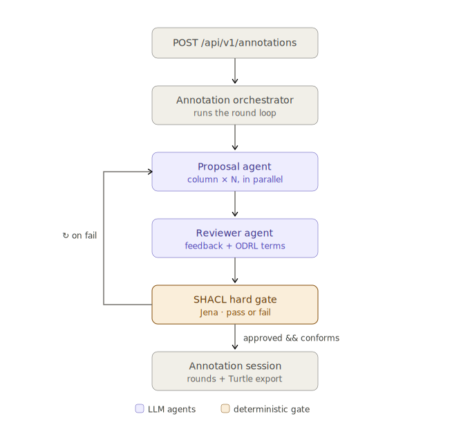

# Semantic Finance — Multi-Agent Dataset Annotation

A Spring Boot 3.3 / Java 21 application that automatically produces DCAT + CSV-W + FIBO + DPV + ODRL + SHACL-compliant semantic annotations for restricted finance datasets using a two-agent AI feedback loop.

## Overview

The application implements the layered semantic architecture described in `finance-dataset-semantic-spec.md`. Two AI agents collaborate iteratively:

- **ProposalAgent** — receives one CSV column at a time and proposes a `propertyUrl` (schema.org or FIBO), a DPV-PD personal-data category, and a semantic note.
- **ReviewerAgent** — receives the full dataset annotation, checks cross-column consistency and SHACL profile compliance, and proposes the ODRL Agreement. Returns structured feedback that the ProposalAgent uses to adjust.

The loop runs until the ReviewerAgent approves **and** Apache Jena SHACL validation passes as a hard gate (default: up to 5 rounds).



## Semantic layers covered

| Layer | Standard | Handled by |
|-------|----------|------------|
| Catalog & dataset metadata | DCAT-AP | `RdfExportService` |
| Logical structure | CSV-W `tableSchema` | `RdfExportService` |
| Domain semantics | schema.org + FIBO FND/BE/FBC | `ProposalAgent` |
| Privacy & lawful use | DPV + DPV-PD | `ProposalAgent` + `RdfExportService` |
| Terms of condition | ODRL Agreement | `ReviewerAgent` |
| Validation | SHACL | `ShaclValidationService` (Jena) |

## Requirements

- Java 21+
- Maven 3.9+
- One of:
  - [Ollama](https://ollama.com) running locally with a pulled model (default: `llama3.1`)
  - OpenAI API key
  - Anthropic API key

## Configuration

Provider is selected in `src/main/resources/application.yml`:

```yaml
llm:
  provider: ollama          # ollama | openai | anthropic
  model: llama3.1           # any model name the provider accepts

ollama:
  base-url: http://localhost:11434

openai:
  base-url: https://api.openai.com
  api-key: ${OPENAI_API_KEY:}

anthropic:
  api-key: ${ANTHROPIC_API_KEY:}

annotation:
  max-rounds: 5
```

Override at runtime with environment variables or system properties:

```bash
# OpenAI
OPENAI_API_KEY=sk-... mvn spring-boot:run -Dspring-boot.run.arguments="--llm.provider=openai --llm.model=gpt-4o"

# Anthropic
ANTHROPIC_API_KEY=sk-ant-... mvn spring-boot:run -Dspring-boot.run.arguments="--llm.provider=anthropic --llm.model=claude-opus-4-8"
```

## Running

```bash
# With Ollama (default)
ollama pull llama3.1
mvn spring-boot:run

# Build a fat JAR
mvn package
java -jar target/semantic-finance-0.1.0-SNAPSHOT.jar
```

## API

### Annotate a dataset

```
POST /api/v1/annotations
Content-Type: application/json
```

Request body:

```json
{
  "datasetTitle": "Customer accounts master",
  "publisherIri": "https://example.org/org-acme-bank",
  "purposeIris": [
    "https://w3id.org/dpv#CreditChecking",
    "https://w3id.org/dpv#FraudPreventionAndDetection"
  ],
  "columns": [
    { "name": "customer_id", "datatype": "string" },
    { "name": "lei",         "datatype": "string" },
    { "name": "legal_name",  "datatype": "string" },
    { "name": "email",       "datatype": "string" },
    { "name": "account_id",  "datatype": "string" },
    { "name": "account_type","datatype": "string" },
    { "name": "balance",     "datatype": "decimal" },
    { "name": "currency",    "datatype": "string" },
    { "name": "opened_date", "datatype": "date" },
    { "name": "jurisdiction","datatype": "string" }
  ]
}
```

Response (abbreviated):

```json
{
  "sessionId": "3fa85f64-...",
  "totalRounds": 2,
  "approved": true,
  "shaclConforms": true,
  "rounds": [ ... ],
  "finalAnnotation": { ... },
  "turtle": "@prefix dcat: ... \nex:dataset a dcat:Dataset ; ..."
}
```

### Retrieve a session

```
GET /api/v1/annotations/{sessionId}
```

### Re-run SHACL validation on a session

```
POST /api/v1/annotations/{sessionId}/validate
```

```json
{
  "sessionId": "3fa85f64-...",
  "conforms": true,
  "violations": []
}
```

## Project structure

```
src/main/java/me/johnra/tutorial/finance/semantic/
├── agent/
│   ├── Agent.java                  — generic Agent<I,O> interface
│   ├── ProposalInput.java
│   ├── proposal/
│   │   ├── ProposalAgent.java      — column-level annotation proposals
│   │   └── ProposalPrompts.java
│   └── review/
│       ├── ReviewerAgent.java      — full-dataset review + ODRL proposal
│       └── ReviewerPrompts.java
├── domain/                         — immutable records
├── vocabulary/
│   ├── Namespaces.java             — all IRI prefix constants
│   ├── PersonalDataCategory.java   — DPV-PD enum (carries IRI)
│   ├── LegalBasis.java             — DPV legal basis enum
│   └── OdrlAction.java             — ODRL action enum
├── service/
│   ├── AnnotationOrchestrator.java — multi-agent loop (virtual threads)
│   ├── ShaclValidationService.java — Jena SHACL hard gate
│   ├── RdfExportService.java       — Turtle serialisation
│   └── llm/
│       ├── LlmClient.java          — provider interface
│       ├── OllamaLlmClient.java
│       ├── OpenAiLlmClient.java
│       └── AnthropicLlmClient.java
├── api/
│   └── AnnotationController.java
└── config/
    ├── LlmConfig.java              — conditional bean per provider
    └── JenaConfig.java             — loads SHACL shapes from classpath
src/main/resources/
├── application.yml
└── shacl/finance-shapes.ttl        — four NodeShapes from spec §11
```

## Design principles

**SOLID**
- *SRP* — each class has one job: propose, review, orchestrate, validate, or export.
- *OCP* — `Agent<I,O>` interface lets new agent types be added without touching the orchestrator.
- *LSP* — `ProposalAgent` and `ReviewerAgent` are interchangeable `Agent` implementations.
- *ISP* — `LlmClient` exposes one method; SHACL and RDF export are separate services.
- *DIP* — all dependencies injected via constructor; `LlmClient` and Jena `Model` as Spring beans.

**DRY**
- All vocabulary IRIs live in `Namespaces.java` — never hardcoded elsewhere.
- `PersonalDataCategory`, `LegalBasis`, and `OdrlAction` enums carry their own IRIs.
- Prompt templates centralised in `ProposalPrompts` / `ReviewerPrompts`.
- A single `LlmClient.complete()` call path covers all three providers.

## License

Restricted — see `finance-dataset-semantic-spec.md §9` for the ODRL Agreement terms.
